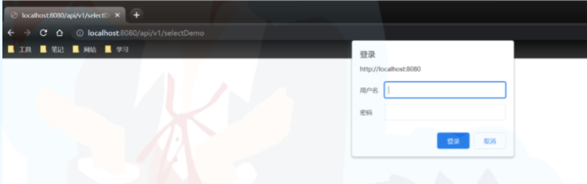
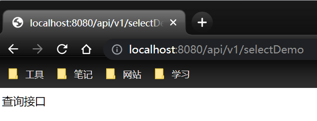
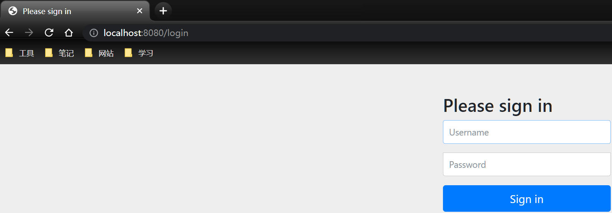
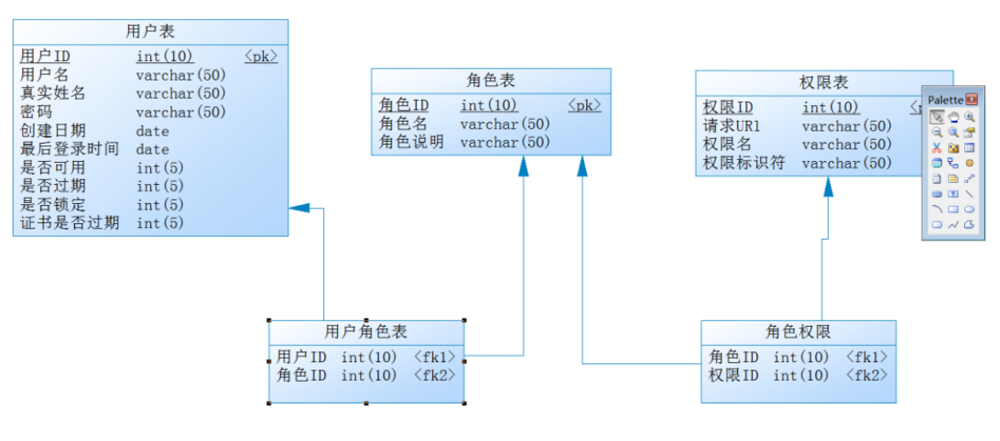
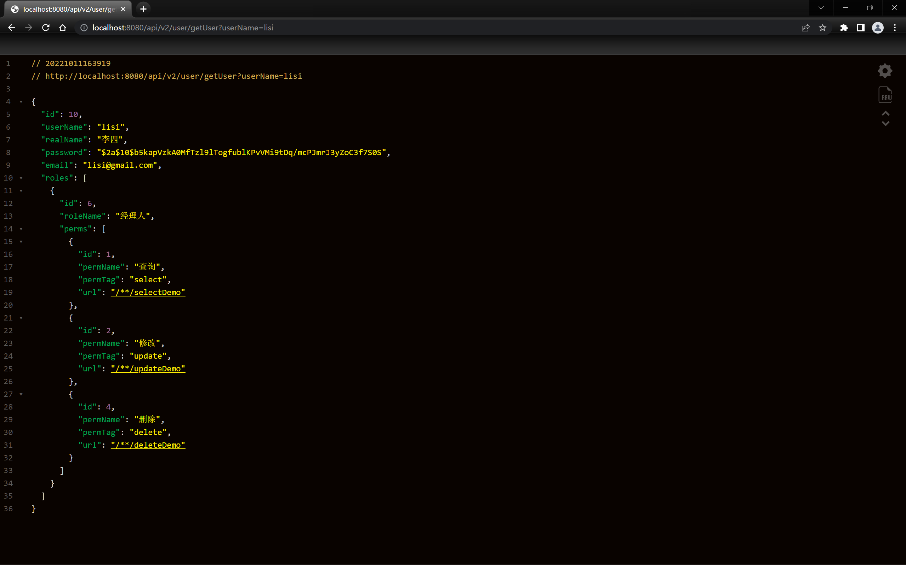

# Spring Security

## 是什么？

&emsp;&emsp;Spring Security是一个能够为基于Spring的企业应用系统提供声明式的安全访问控制解决方案的安全框架。它提供了一组可以在Spring应用上下文中配置的Bean，充分利用了Spring
IoC，DI（控制反转Inversion of Control ,DI:Dependency Injection
依赖注入）和AOP（面向切面编程）功能，为应用系统提供声明式的安全访问控制功能，减少了为企业系统安全控制编写大量重复代码的工作。  
摘自百度百科:
https://baike.baidu.com/item/spring%20security/8831652?fr=aladdin

## 实现Basic认证

### 添加依赖

```groovy
implementation 'org.springframework.boot:spring-boot-starter-data-jpa'
implementation 'org.springframework.boot:spring-boot-starter-security'
implementation 'org.springframework.boot:spring-boot-starter-thymeleaf'
implementation 'org.springframework.boot:spring-boot-starter-web'
implementation 'org.thymeleaf.extras:thymeleaf-extras-springsecurity5'
```

### Demo接口

```java

@RestController
@Slf4j
@RequestMapping("api/v1")
public class DemoApi {
	
	@GetMapping("/addDemo")
	public String addDemo() {
		return "添加接口";
	}
	
	@GetMapping("/updateDemo")
	public String updateDemo() {
		return "修改接口";
	}
	
	@GetMapping("/deleteDemo")
	public String deleteDemo() {
		return "删除接口";
	}
	
	@GetMapping("/selectDemo")
	public String selectDemo() {
		return "查询接口";
	}
}
```

### 配置类

&emsp;&emsp;当我想使用继承`WebSecurityConfigurerAdapter`类的时候，发现它已经被弃用了，
在源码中他提供了替代方法：  

意思就是 :   
&emsp;&emsp;使用org.springframework.security.web.SecurityFilterChain Bean 来配置 HttpSecurity 或使用 WebSecurityCustomizer
Bean 来配置 WebSecurity。  
&emsp;&emsp;所以现在的配置类可以这样写 :

```java

@Component
@EnableWebSecurity
@RequiredArgsConstructor
public class SecurityConfig {
	
	private final PasswordEncoder passwordEncoder;
	
	@Bean
	UserDetailsService userDetailsService() {
		InMemoryUserDetailsManager users = new InMemoryUserDetailsManager();
		users.createUser(
				User.withUsername("xiaoyi")
						.password(passwordEncoder.encode("123456"))
						.roles("admin")
						.build());
		return users;
	}
	
	@Bean
	SecurityFilterChain securityFilterChain(HttpSecurity httpSecurity) throws Exception {
		return httpSecurity
				.authorizeRequests()
				.antMatchers("/**")
				.fullyAuthenticated()
				.and()
				.httpBasic()
				.and()
				.build();
	}
}
```

**注意**

1. 记得开启，`@EnableWebSecurity`
2. 要对密码进行编码。否则会出现`编码的密码看起来不像Bcrypt`这样的错误。
3. 在main类中创建编码的Bean。

```java
  @Bean
  PasswordEncoder passwordEncoder(){
		  return new BCryptPasswordEncoder();
		  }
```


然后输入账号和密码，这个账号和密码是配置SecurityConfig类创建用户使用的账号和密码。  


## 实现表单模式

将配置类中httpBasic改成formLogin就可以了。

```java
    @Bean
	SecurityFilterChain securityFilterChain(HttpSecurity httpSecurity)throws Exception{
				return httpSecurity
				.authorizeRequests()
				.antMatchers("/**")
				.fullyAuthenticated()
				.and()
				.formLogin()
				.and()
				.build();
				}
```



## 配置权限策略

&emsp;&emsp;在企业管理系统平台中，会拆分成n多个不同的账号，
每个账号对应不同的接口访问权限。比如：

* add用户可以访问添加接口
* del用户可以访问删除接口
* update用户可以访问修改接口
* show用户可以访问查询接口
* admin用户可以访问所有接口

配置类如下 :

```java

@Component
@EnableWebSecurity
@RequiredArgsConstructor
public class SecurityConfig {
	
	private final PasswordEncoder passwordEncoder;
	
	@Bean
	UserDetailsService userDetailsService() {
		InMemoryUserDetailsManager users = new InMemoryUserDetailsManager();
		users.createUser(
				User.withUsername("admin")
						.password(passwordEncoder.encode("123456"))
						.authorities("insert", "delete", "update", "show")
						.build());
		users.createUser(
				User.withUsername("insert")
						.password(passwordEncoder.encode("123456"))
						.authorities("insert")
						.build());
		users.createUser(
				User.withUsername("show")
						.password(passwordEncoder.encode("123456"))
						.authorities("show")
						.build());
		users.createUser(
				User.withUsername("delete")
						.password(passwordEncoder.encode("123456"))
						.authorities("delete")
						.build());
		users.createUser(
				User.withUsername("update")
						.password(passwordEncoder.encode("123456"))
						.authorities("update")
						.build());
		return users;
	}
	
	@Bean
	SecurityFilterChain securityFilterChain(HttpSecurity httpSecurity) throws Exception {
		return httpSecurity
				.authorizeRequests()
				.antMatchers("/**/addDemo")
				.hasAnyAuthority("insert")
				.antMatchers("/**/updateDemo")
				.hasAnyAuthority("update")
				.antMatchers("/**/deleteDemo")
				.hasAnyAuthority("delete")
				.antMatchers("/**/selectDemo")
				.hasAnyAuthority("show")
				.antMatchers("/**")
				.fullyAuthenticated()
				.and()
				// .httpBasic()
				.formLogin()
				.and()
				.build();
	}
}
```

## 错误页面修改

使用自定义异常

```java

@Configuration
public class ExceptionConfig {
	@Bean
	public ConfigurableServletWebServerFactory webServerFactory() {
		TomcatServletWebServerFactory factory = new TomcatServletWebServerFactory();
		ErrorPage errorPage400 = new ErrorPage(HttpStatus.BAD_REQUEST, "/error/400");
		ErrorPage errorPage401 = new ErrorPage(HttpStatus.UNAUTHORIZED, "/error/401");
		ErrorPage errorPage403 = new ErrorPage(HttpStatus.FORBIDDEN, "/error/403");
		ErrorPage errorPage404 = new ErrorPage(HttpStatus.NOT_FOUND, "/error/404");
		ErrorPage errorPage415 = new ErrorPage(HttpStatus.UNSUPPORTED_MEDIA_TYPE, "/error/415");
		ErrorPage errorPage500 = new ErrorPage(HttpStatus.INTERNAL_SERVER_ERROR, "/error/500");
		factory.addErrorPages(
				errorPage400, errorPage401, errorPage403, errorPage404, errorPage415, errorPage500);
		return factory;
	}
}
```

编写异常接口

```java

@RestController
public class ErrorException {
	
	@RequestMapping("/error/403")
	public String error() {
		return "您当前访问的接口权限不足!";
	}
}
```

然后重启项目访问就可以了。

## 自定义登录页面

配置文件添加配置

```properties
spring.freemarker.settings.datetime_format=yyy-MM-dd HH:mm
spring.freemarker.settings.number_format=0.##
spring.freemarker.suffix=.ftl
spring.freemarker.template-loader-path=classpath:/templates
```

添加依赖

```groovy
implementation group: 'org.springframework.boot', name: 'spring-boot-starter-freemarker', version: '2.7.4'
```

修改SecurityConfig

```java
@Bean
  SecurityFilterChain securityFilterChain(HttpSecurity httpSecurity)throws Exception{
		  return httpSecurity
		  .authorizeRequests()
		  .antMatchers("/**/addDemo")
		  .hasAnyAuthority("insert")
		  .antMatchers("/**/updateDemo")
		  .hasAnyAuthority("update")
		  .antMatchers("/**/deleteDemo")
		  .hasAnyAuthority("delete")
		  .antMatchers("/**/selectDemo")
		  .hasAnyAuthority("show")
		  .antMatchers("/login")
		  .permitAll()
		  .antMatchers("/**")
		  .fullyAuthenticated()
		  .and()
		  // .httpBasic()
		  .formLogin()
		  .loginPage("/login")
		  .and()
		  .csrf()
		  .disable()
		  .build();
		  }
```

登录页面 ：resources/templates/login.ftl  
静态资源 ：resources/static/css/css.css

添加login登录接口

```java

@Controller
public class LoginApi {
	
	@RequestMapping("/login")
	public String login() {
		return "login";
	}
}
```

**问题**  
&emsp;&emsp;这可能导致css没效果，我不知道是什么原因，如果有知道原因的可以告诉一下。

## 动态权限控制

### Rbac权限表设计

&emsp;&emsp;RBAC（基于角色的权限控制）模型的核心是在用户和权限之间引入了角色的概念。
取消了用户和权限的直接关联，改为通过用户关联角色、角色关联权限的方法来
间接地赋予用户权限（如下图），从而达到用户和权限解耦的目的。



### 使用JPA创建数据库

&emsp;&emsp;通过分析上图可以知道有三张主表——权限表、角色表和用户表
所以在domain目录下创建三个类：  
&emsp;&emsp;首先先添加依赖：

```groovy
implementation 'org.springframework.boot:spring-boot-starter-data-jpa'
compileOnly 'org.projectlombok:lombok'
runtimeOnly 'mysql:mysql-connector-java'
annotationProcessor 'org.projectlombok:lombok'
```

```java
// 权限表
@Entity
@Data
@AllArgsConstructor
@NoArgsConstructor
public class Permission {
	@Id
	@GeneratedValue(strategy = GenerationType.AUTO)
	private Long id;
	
	private String permName;
	// 权限标识
	private String permTag;
	// 请求url
	private String url;
}
```

**权限表和角色表之间是多对多的关系。**

```java
// 角色表
@Entity
@Data
@AllArgsConstructor
@NoArgsConstructor
public class Role {
	@Id
	@GeneratedValue(strategy = GenerationType.AUTO)
	private Long id;
	
	private String roleName;
	@ManyToMany
	private Collection<Permission> Perms = new ArrayList<>();
}
```

**角色表和用户表之间的关系也是多对多**

```java
// 用户表
@Entity
@Data
@Table(name = "user")
@AllArgsConstructor
@NoArgsConstructor
public class User {
	@Id
	@GeneratedValue(strategy = GenerationType.AUTO)
	@Column(name = "id", nullable = false)
	private Long id;
	
	private String userName;
	
	private String password;
	
	private String email;
	
	@ManyToMany
	private Collection<Role> roles = new ArrayList<>();
}
```

&emsp;&emsp;创建一个repo目录。然后为这三张表生成各自的存储库（repository）。  


接下来编写服务层代码

```java
// 服务接口
public interface UserService {
	
	Permission savePerm(Permission permission);
	
	Role saveRole(Role role);
	
	User saveUser(User user);
	
	void saveRoleToUser(String userName, String roleName);
	
	void savePermToRole(String roleName, String permName);
}
```

```java
// 服务实现类
@Service
@Transactional
@Slf4j
@RequiredArgsConstructor
public class UserServiceImpl implements UserService {
	
	private final UserRepository userRepository;
	private final RoleRepository roleRepository;
	private final PermissionRepository permRepository;
	private final PasswordEncoder passwordEncoder;
	
	/**
	 * 保存权限
	 *
	 * @param permission 权限
	 * @return 权限
	 */
	@Override
	public Permission savePerm(Permission permission) {
		log.info("保存权限{}", permission.getPermName());
		return permRepository.save(permission);
	}
	
	/**
	 * 保存角色
	 *
	 * @param role 角色
	 * @return 角色
	 */
	@Override
	public Role saveRole(Role role) {
		log.info("保存角色:{}", role.getRoleName());
		return roleRepository.save(role);
	}
	
	/**
	 * 保存用户
	 *
	 * @param user 用户
	 * @return 用户
	 */
	@Override
	public User saveUser(User user) {
		log.info("保存用户{}", user.getUserName());
		user.setPassword(passwordEncoder.encode(user.getPassword()));
		return userRepository.save(user);
	}
	
	/**
	 * 将角色赋予用户
	 *
	 * @param userName 用户名称
	 * @param roleName 角色名称
	 */
	@Override
	public void saveRoleToUser(String userName, String roleName) {
		log.info("将角色{}赋予用户{}", roleName, userName);
		User user = userRepository.findByUserName(userName);
		Role role = roleRepository.findByRoleName(roleName);
		user.getRoles().add(role);
	}
	
	/**
	 * 将权限赋予角色
	 *
	 * @param roleName 角色名称
	 * @param permName 权限名称
	 */
	@Override
	public void savePermToRole(String roleName, String permName) {
		log.info("将权限{}赋予角色{}", permName, roleName);
		Role role = roleRepository.findByRoleName(roleName);
		Permission perm = permRepository.findByPermName(permName);
		role.getPerms().add(perm);
	}
}
```

使用Idea连接到数据库，创建一个新的数据库。  
然后添加配置

```properties
server.port=8080
spring.datasource.driver-class-name=com.mysql.cj.jdbc.Driver
spring.datasource.url=jdbc:mysql://localhost:3306/demo01?characterEncoding=utf-8&useSSL=false&serverTimezone=Asia\
  /Shanghai
spring.datasource.username=root
spring.datasource.password=123456
spring.jpa.hibernate.ddl-auto=create
spring.jpa.show-sql=true
spring.jpa.properties.hibernate.dialect=org.hibernate.dialect.MySQL8Dialect
spring.jpa.properties.hibernate.format_sql=true
spring.freemarker.settings.classic_compatible=true
```

&emsp;&emsp;最后在SpringBoot入口类中添加CommandLineRunner的Bean

```java

@SpringBootApplication
public class SpringSecurityApplication {
	
	public static void main(String[] args) {
		SpringApplication.run(SpringSecurityApplication.class, args);
	}
	
	@Bean
	PasswordEncoder passwordEncoder() {
		return new BCryptPasswordEncoder();
	}
	
	@Bean
	CommandLineRunner run(UserService userService) {
		return args -> {
			// 保存权限
			userService.savePerm(new Permission(null, "查询", "select", "/selectDemo"));
			userService.savePerm(new Permission(null, "修改", "update", "/updateDemo"));
			userService.savePerm(new Permission(null, "添加", "add", "/addDemo"));
			userService.savePerm(new Permission(null, "删除", "delete", "/deleteDemo"));
			// 保存角色
			userService.saveRole(new Role(null, "管理人", new ArrayList<>()));
			userService.saveRole(new Role(null, "经理人", new ArrayList<>()));
			userService.saveRole(new Role(null, "法务人", new ArrayList<>()));
			userService.saveRole(new Role(null, "其他人", new ArrayList<>()));
			// 保存用户
			userService.saveUser(
					new User(null, "zhangsan", "张三", "123456", "zhangsan@gmail.com", new ArrayList<>()));
			userService.saveUser(
					new User(null, "lisi", "李四", "123456", "lisi@gmail.com", new ArrayList<>()));
			userService.saveUser(
					new User(null, "wangwu", "王五", "123456", "wangwu@gmail.com", new ArrayList<>()));
			userService.saveUser(
					new User(null, "zhaoliu", "赵六", "123456", "zhaoliu@gmail.com", new ArrayList<>()));
			// 将权限赋予角色
			userService.savePermToRole("管理人", "查询");
			userService.savePermToRole("管理人", "修改");
			userService.savePermToRole("管理人", "添加");
			userService.savePermToRole("管理人", "删除");
			userService.savePermToRole("经理人", "查询");
			userService.savePermToRole("经理人", "修改");
			userService.savePermToRole("经理人", "删除");
			userService.savePermToRole("法务人", "添加");
			userService.savePermToRole("法务人", "查询");
			userService.savePermToRole("其他人", "查询");
			// 将角色赋予用户
			userService.saveRoleToUser("zhangsan", "管理人");
			userService.saveRoleToUser("lisi", "经理人");
			userService.saveRoleToUser("wangwu", "法务人");
			userService.saveRoleToUser("wangwu", "经理人");
			userService.saveRoleToUser("zhaoliu", "其他人");
		};
	}
}
```

&emsp;&emsp;启动项目，就可以在日志中看到SQL语句了。打开数据库就可以看到表和记录都有了。

### 查询用户的权限

可以暴露查询用户的接口

```java

@RestController
@RequestMapping("/api/v2/user")
@Slf4j
@RequiredArgsConstructor
public class UserApi {
	
	private final UserService userService;
	
	/**
	 * 根据用户名称获取用户信息
	 *
	 * @param userName
	 * @return
	 */
	@GetMapping("/getUser")
	public ResponseEntity<User> getUser(String userName) {
		return ResponseEntity.ok().body(userService.getByUserName(userName));
	}
}
```


可以看到里面有用户的所有信息

### 动态权限控制相关配置

在config目录中创建一个类来实现UserDetailsService

```java

@Component
@RequiredArgsConstructor
public class DemoDetailsService implements UserDetailsService {
	
	private final UserRepository userRepository;
	
	/**
	 * 获取用户权限
	 *
	 * @param username the username identifying the user whose data is required.
	 * @return userDetails
	 */
	@Override
	public UserDetails loadUserByUsername(String username) {
		User user = userRepository.findByUserName(username);
		assert user!=null;
		Set<SimpleGrantedAuthority> set = new HashSet<>();
		Collection<Role> roles = user.getRoles();
		roles.forEach(
				role -> {
					role.getPerms()
							.forEach(
									permission -> {
										set.add(new SimpleGrantedAuthority(permission.getPermTag()));
									});
				});
		return new org.springframework.security.core.userdetails.User(
				user.getUserName(), user.getPassword(), set);
	}
}
```

SecurityConfig配置类的修改  
**说明**  
由于新写法总是出现问题，所以使用的是老版本的写法。

```java

@Configuration
@EnableWebSecurity
@RequiredArgsConstructor
public class OldSecurityConfig extends WebSecurityConfigurerAdapter {
	
	private final PasswordEncoder passwordEncoder;
	private final UserService userService;
	private final UserDetailsService userDetailsService;
	
	/**
	 * 新增Security 授权的账户
	 *
	 * @param auth
	 * @throws Exception
	 */
	@Override
	protected void configure(AuthenticationManagerBuilder auth) throws Exception {
		auth.userDetailsService(userDetailsService).passwordEncoder(passwordEncoder);
	}
	
	@Override
	protected void configure(HttpSecurity http) throws Exception {
		ExpressionUrlAuthorizationConfigurer<HttpSecurity>.ExpressionInterceptUrlRegistry
				authorizeRequests = http.authorizeRequests();
		// 1.需要查询到所有的权限
		List<Permission> allPermission = userService.findAllPermission();
		allPermission.forEach(
				(p -> {
					// 将该规则添加
					authorizeRequests.antMatchers(p.getUrl()).hasAnyAuthority(p.getPermTag());
				}));
		//
		// 可以允许login 不被拦截
		authorizeRequests
				.antMatchers("/login")
				.permitAll()
				// 设置自定义登录页面
				.antMatchers("/**")
				.fullyAuthenticated()
				.and()
				.formLogin()
				.loginPage("/login")
				.and()
				.csrf()
				.disable();
	}
}
```

## 整合oauth2

### 概念

&emsp;&emsp;OAuth 2.0 是一个授权协议，它允许软件应用代表（而不是充当）资源拥有者去访问资源
拥有者的资源。应用向资源拥有者请求授权，然后取得令牌（token），并用它来访问资源，
并且资源拥有者不用向应用提供用户名和密码等敏感数据。

&emsp;&emsp;很遗憾，刚想使用的时候看到里面继承的父类已经过时了，上网查了一下发现
**Spring 团队正式宣布 Spring Security OAuth 停止维护，该项目将不会再进行任何的迭代**。

&emsp;&emsp;所以这个项目将使用Spring团队发布的替代品**Spring Authorization Server**。  

**以后会持续更新**